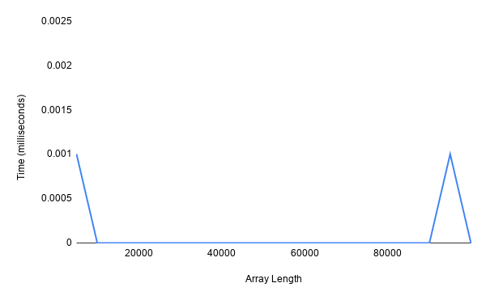
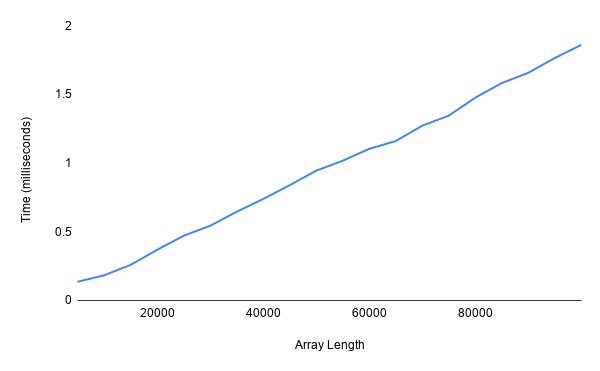
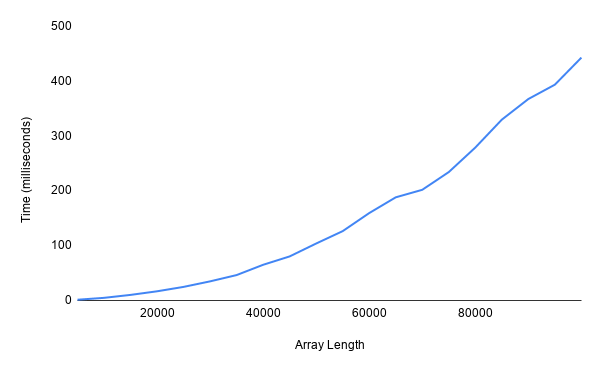
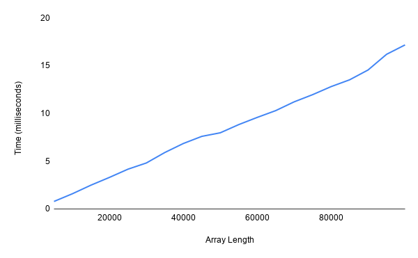

# Algorithmic Complexity

## Timing Framework

This is some code which times how long array methods take to run on inputs of varying sizes.

## How to Use

1. Ensure you have [Ruby](https://www.ruby-lang.org/en/documentation/installation/) and [Bundler](https://bundler.io/) installed.
2. Clone this repository.
3. In the command line: run `bundle` to install dependencies.
4. From the root directory, run `irb -r ./timing_framework.rb` to enter Ruby's REPL.
5. Create a new TimingFramework object with `TimingFramework.new`.
6. Call the `#run` method on your object. This takes a `method_list` keyword argument: an array of the methods you would like to time, as symbols. For example, `timing_framework.run(method_list: [:reverse, :sort])`. If no arguments are given, the default methods are `[:last, :reverse, :shuffle, :sort]`.
7. Require files from the /lib folder to test methods I have written, e.g. `require './lib/most_frequent.rb'`. These methods are monkey-patched onto the Array class.
8. The `#run` method will produce .txt files in the root directory with timing data (in milliseconds) for each method.
   These files are ready to be imported into spreadsheet software. Currently, each method is called on inputs ranging between 5000-100000 (intervals of 5000). The methods are repeated on each input size 100 times to improve data quality.

To run tests, quit irb and run `rspec` from the root directory.

Code example:

```
irb -r ./timing_framework.rb
2.6.3 :001 > timing_framework = TimingFramework.new
2.6.3 :002 > timing_framework.run(method_list: [:sort])
=> nil
2.6.3 :003 > require './lib/find_duplicates.rb'
=> true
2.6.3 :004 > timing_framework.run(method_list: [:reverse, :find_duplicates])
=> nil
```

## Time Complexity

  
_Image source: [https://www.wikitechy.com/technology/a-time-complexity-question/]_

---**BEST PERFORMING**---

### Constant Time

Increase in input size causes no increase in run time.

### Logarithmic Time

Run time eventually levels off with increasing input size.

### Linear Time

Linear increase in run time with input size.

### Quadratic/ Cubic Time

Upward curve in run time with input size: y = x^2.

### Exponential Time

Similar to quadratic but more severe performance issues: y = 2^x. Symmetric of logarithmic graph.

---**WORST PERFORMING**---

## Results

The following graphs plot the median time for each input size, as this produced the smoothest graphs. This is a sample of the methods tested. The full data is in the /results folder.

### Last

Constant time: almost no time at all to complete. Elements of an array can be accessed in constant time as their address in memory is known.



### Shuffle

Linear time for in-built version of shuffle method:



On my first attempt at a re-write, the method had mediocre performance (quadratic time). The code used and performance graph are below:

```
def new_shuffle
  initial_array = clone
  result = []
  until initial_array.empty?
    i = rand(initial_array.length)
    result << initial_array[i]
    initial_array.delete_at(i)
  end
  result
end
```



The performance is quadratic time as looping the length of the array is linear time, and the `#delete_at` method within that loop is also linear time (it causes remapping). In other words it is linear time 'squared'.

After observing this issue, I re-wrote the method again. Instead of using `#delete_at` within the loop, the last element of the array and the one to be removed are swapped. We can then `#pop` from the end of the array. These actions are all constant time, as the address in memory in each case is known and no remapping takes place. This makes the method linear time overall. The new code and performance graph are below:

```
def new_shuffle
  initial_array = clone
  result = []
  until initial_array.empty?
    i = rand(initial_array.length)
    result << initial_array[i]
    initial_array[i] = initial_array.last
    initial_array.pop
  end
  result
end
```



Interesting to note: this rewritten version is still around 10x slower than the `#shuffle` method built-in to Ruby.

## Thoughts

- Building timing_framework.rb was enjoyable. There may be opportunities to optimise it's performance!
- There are some more methods I'd like to try testing: sorting an array of 1s and 0s, fibonacci sequence (a comparison of looping and recursive solutions might be interesting), name pairing, and sub-sequence summing.
- A runner program which requires the relevant files and includes helper functions may be useful for users.
- I believe there are Ruby gems which automatically produce graphs when given data. This would be more convenient than manually exporting results files.
