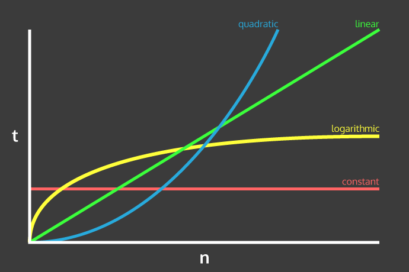

# Algorithmic Complexity

## Timing Framework

This is some code which times how long array methods take to run on inputs of varying sizes.

### How to Use

1. Ensure you have [Ruby](https://www.ruby-lang.org/en/documentation/installation/) and [Bundler](https://bundler.io/) installed.
2. Clone this repository.
3. In the command line: run `bundle` to install dependencies.
4. From the root directory, run `irb -r ./timing_framework.rb` to enter Ruby's REPL.
5. Create a new TimingFramework object with `TimingFramework.new`.
6. Call the `#run` method on your object. This takes a `method_list` keyword argument: an array of the methods you would like to time, as symbols. For example, `timing_framework.run(method_list: [:reverse, :sort])`. If no arguments are given, the default methods are `[:last, :reverse, :shuffle, :sort]`.
7. Require files from the /lib folder to test methods I have written, e.g. `require './lib/most_frequent.rb'`. These methods are monkey-patched onto the Array class.
8. The `#run` method will produce .txt files in the root directory with timing data (in milliseconds) for each method.
   These files are ready to be imported into spreadsheet software. Currently, each method is called on inputs ranging between 5000-100000 (intervals of 5000). The methods are repeated on each input size 100 times to improve data quality.

Code example:

```
irb -r ./timing_framework.rb
2.6.3 :001 > timing_framework = TimingFramework.new
2.6.3 :002 > timing_framework.run(method_list: [:sort])
=> nil
2.6.3 :003 > require './lib/find_duplicates.rb'
=> true
2.6.3 :004 > timing_framework.run(method_list: [:reverse, :find_duplicates])
=> nil
```

### Time Complexity


Image source: https://www.wikitechy.com/technology/a-time-complexity-question/

---BEST PERFORMING---

#### Constant Time

Increase in input size causes no increase in run time.

#### Logarithmic Time

Run time eventually levels off with increasing input size.

#### Linear

Linear increase in run time with input size.

#### Quadratic/ Cubic

Upward curve in run time with input size: y = x^2

#### Exponential

Similar to quadratic but more severe performance issues: y = 2^x. Symmetric of logarithmic graph.

---WORST PERFORMING---
